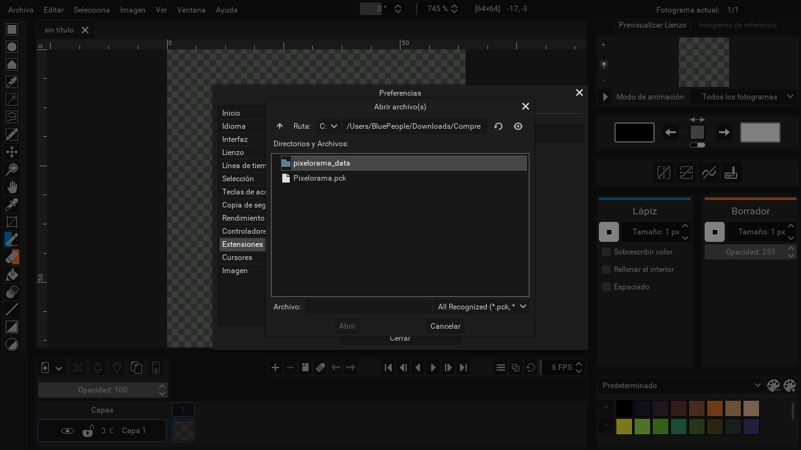

# Import/Export for Pixelorama

an extension for pixelorama that adds new import/export options to the program.

## Installation

1. Look for the latest version of the extension in release (check if it matches the version of pixelorama you use).

    

2. Opens pixelorama. 
    
3. open settings>extensions
    
4. Locate the extension (or simply drag the file)
    
5. Enable the extension
    
6. Ready for use :)
    

